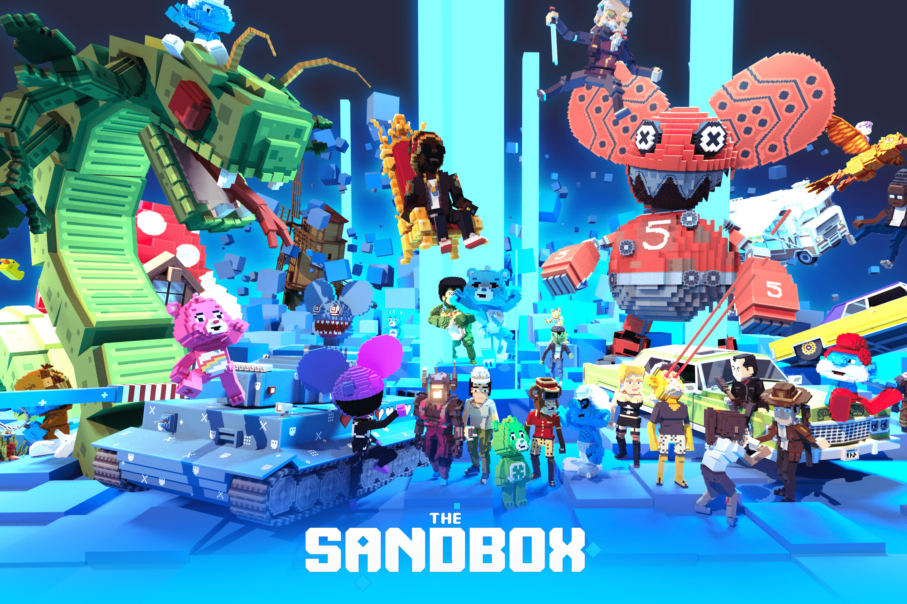

# The Sandbox

由玩家打造的去中心化游戏平台 将您的创作自由提升到一个新的水平并在区块链中获利！玩，创造和赚钱！
沙盒是推动虚拟房地产需求近期增长的主要虚拟世界地点，与行尸走肉、雅达利、过山车大亨、护理熊、蓝精灵、小羊肖恩和币安等主要 IP 和品牌合作.
以现有的 The Sandbox IP 为基础，在全球拥有超过 4000 万的移动设备安装量，The Sandbox metaverse 为玩家和创作者提供了一个分散且直观的平台，以创建身临其境的 3D 世界和游戏体验，并安全地存储、交易和货币化他们的创作。欲了解更多信息，请访问 www.sandbox.game 并关注 Twitter、Medium 和 Discord 上的定期更新。

