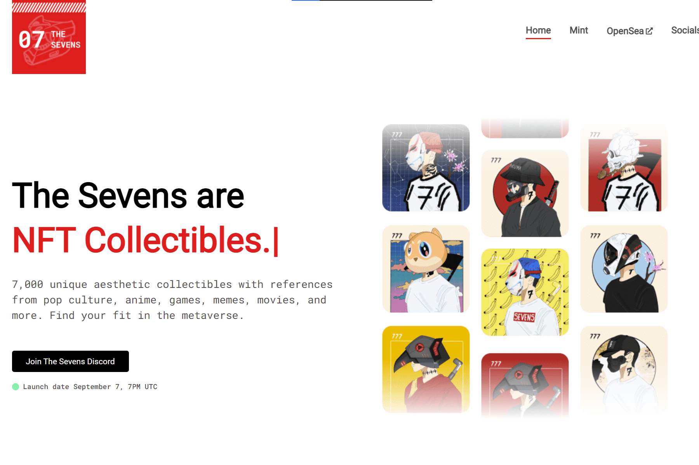

# The Sevens (Official)

概述
The Sevens 是 7000 件由算法生成的艺术作品的集合，其中参考了流行文化、动漫、游戏、模因和电影。该系列专注于街头服饰，如衬衫、连帽衫、头饰等。在我们即将到来的寻宝活动中使用您的 Sevens 或在我们的商店 (TBA) 订购您的 Sevens 赃物。
故事
2077 年的反乌托邦未来。在全球大崩溃之后，我们的反主流文化正在数字宇宙中寻找救赎：由以太坊区块链驱动的元宇宙。电影、游戏、漫画书和音乐的时间不受限制。在那里，世界正在燃烧。
几代人以来，我们一直通过虚拟自我替代生活，逃离由腐败政府统治的物质世界、混乱世界。
元宇宙中隐藏着巨大的宝藏。必须做出牺牲才能找到这些宝藏，许多世代已经失败并被活活烧死。我们是第七代（被称为“七人组”），我们比以往任何时候都更强大。我们最终能找到最大的宝藏并重新控制物质世界吗？纵观历史，“7”在许多文化中一直被认为是幸运数字。我们，七人组，能保持预言和我们自己的生命吗？

