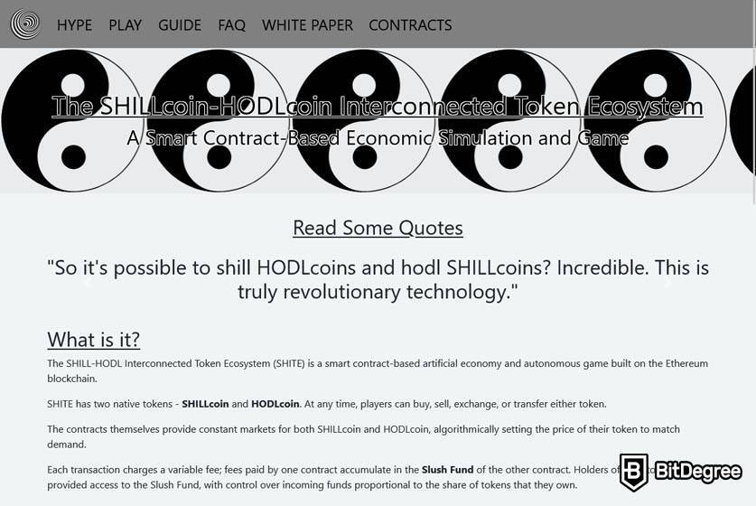

# The SHILLcoin HODLcoin

SHILLcoin HODLcoin 互联代币生态系统 (SHITE) 是一款基于 Dapp 的新型游戏，建立在两个兼容 ERC20 的代币上——SHILLcoins 和 HODLcoins。两种代币的自动化市场都是由它们各自的智能合约生成的。这些市场会根据玩家的行为不断、智能地调整经济激励措施，这意味着最优策略在不断发展。该生态系统旨在模仿加密货币市场。玩家可以购买 SHILLcoins 并成为 Shill 或 HODLcoins 并成为 Hodler。对于他们持有的每个代币，他们都会从其他玩家的交易费用中获得奖励。奖励授予对 Slush Fund 的访问权限，可用于双倍下注并购买更多代币或兑现到 Ether。那些精通游戏的人可以设计他们的游戏风格来操纵 SHITE 的自动化市场以谋取利益。然而，他们可能会发现自己与其他试图根据自己的目的塑造市场的参与者发生争执。

