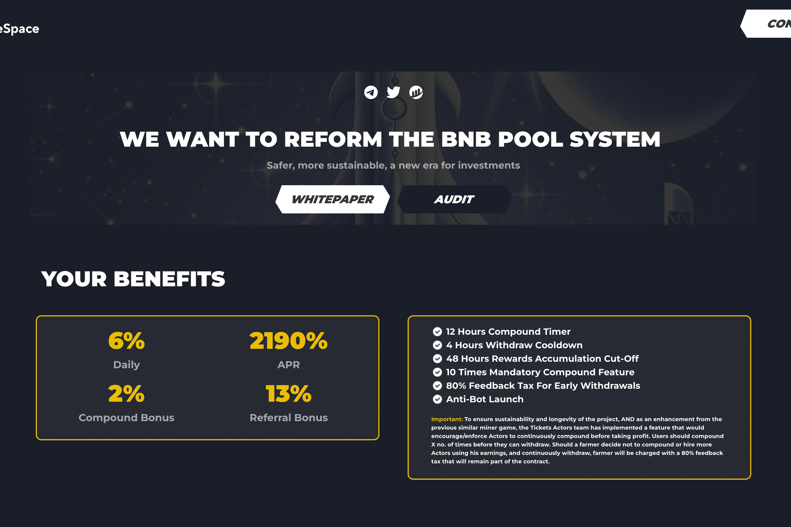

# The Space Finance

BNB TheSpace 是一个基于币安智能链的去中心化应用。 游戏的目的是比其他农民更快、更频繁地雇佣更多的农民。 这反过来又可以更快地为您赚取更多的 BNB。 这些农民不知疲倦地为您工作，平均每天为您提供农民价值的 6%。 每日百分比回报取决于农民在平台内采取的影响农民效率的行动。 随着用户购买 Farmers、重新雇用您的收入并出售您的代币以换取 BNB，耕作效率会上升和下降。 一旦购买了农民，他们就无法出售，并且为重新雇用他们（通过雇用或重新雇用）而进行的投资无法收回。 但是，一旦购买，农民将不会停止生产

