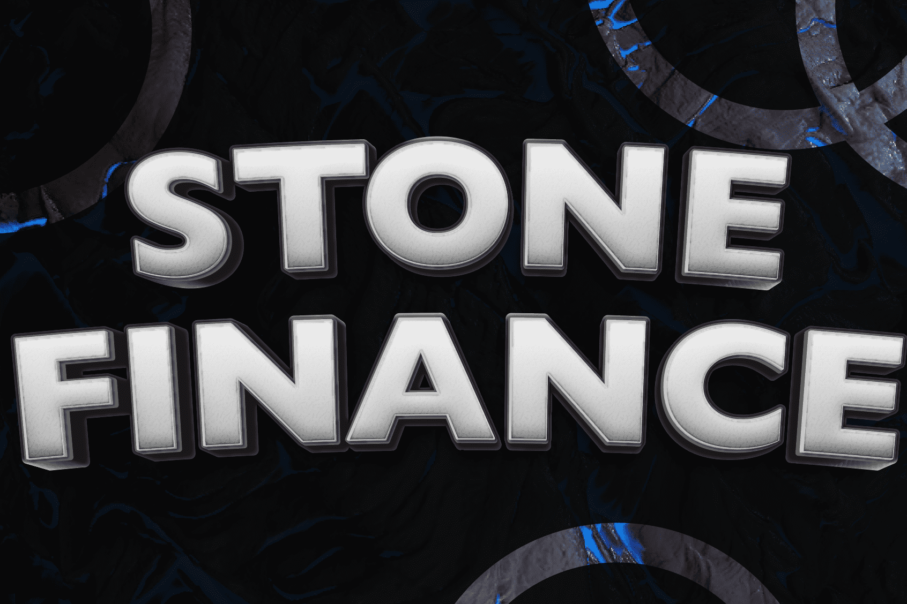

# The Stone Finance

Stone Finance 结合了 Fantom Opera 网络原生的去中心化收益协议，允许用户以高达 80.000% 的 APR 抵押他们的资产。目前，Stone Finance 为用户提供了 3 个主要功能来赚取被动收入：Stone Bonds、Stone Shares 和 Genesis Pools。
$SBOND 的主要功能是在纪元收缩期间激励 $STONE 供应变化。当 $STONE 的 TWAP（时间加权平均价格）低于 1 时，会以当前 $STONE 价格发行和购买 SBOND，这会烧掉 $STONE 并使 $STONE 退出流通（通货紧缩）并有助于使 $STONE 价格回升到挂钩。
$STONE SHARE 是衡量 STONE FINANCE 和股东信托在保持 $STONE 接近挂钩的能力方面价值的一种方法。该协议铸造 $STONE 并将其按比例分配给整个时期扩展的所有 $STONE 质押者。此外，$STONE 持有者对改进 Stone Finance 生态系统中的协议和未来用例的建议拥有投票权。 （投票我们应该每周添加哪些池）。
最后但同样重要的是，Genesis Pools 使用户能够通过将用户的代币存入池中来赚取免费的 $STONE。 （支持 FTM、BOO、USDC、DAI）。然而，它只持续两天，所以你必须抓紧时间，才有机会赚取 80,000% APR。
此外，The Stone NFT Marketplace 将允许用户展示收藏，并为收藏中的所有 NFT 提供额外的可选版税。 Fantom 上的 NFT 合约开发商现在拥有一个一站式商店来宣传和销售他们的收藏。

