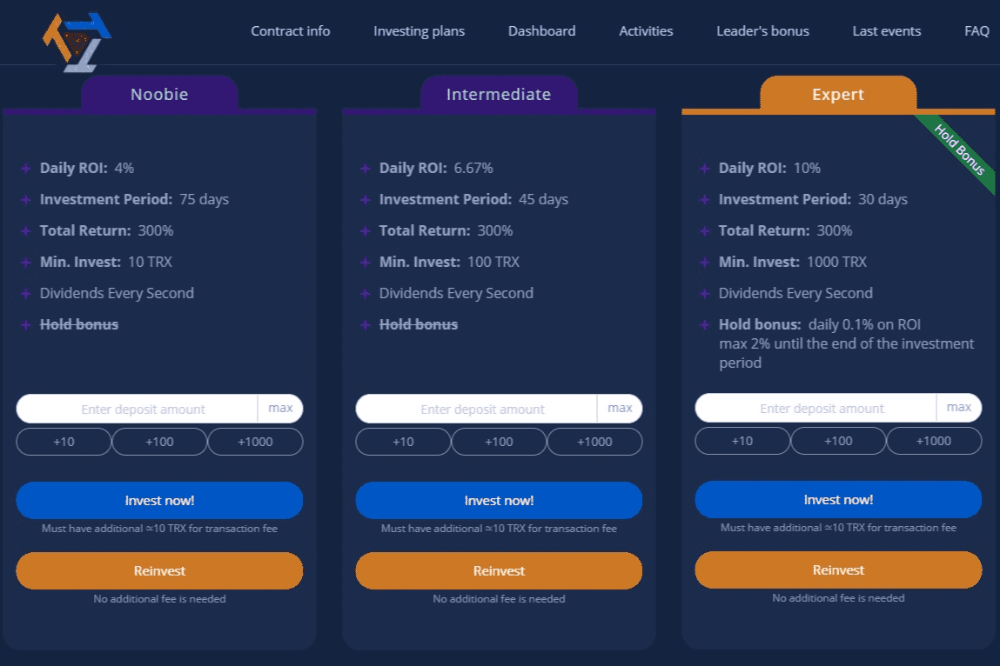

# The Tron Triple

在 DApps 中拥有最多的利润！
300%利润+2%持仓红利+10%资金红利+14%推荐红利+2%受邀红利+领队红利
验证合同
防鲸系统
只需 1 步即可了解它的逻辑性和可持续性。
充满潜力
不要让它迟到！

Tron Triple DAPP 技术分析。 Tron Triple dApp 是一种基于 Tron 协议的高风险类别的加密资产。 现在，根据用户数量，它在一般 dApp 排名中排名第 1989 位，在高风险类别中排名第 529 位，这让您可以很好地了解 The Tron Triple dApp 在其竞争对手中的表现。

