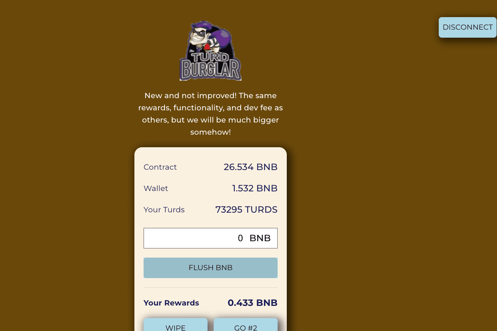

# The Turd Burglar

新的，没有改进！ 与其他人一样的奖励、功能和开发费用，但我们会以某种方式变得更大！ 以 meme 为主题的 BNB 矿工。

俚语 Turd Burglar 有很多含义。

大多数人在使用俚语“turd burglar”时，指的是他们在公共厕所（主要是办公室、工作场所）拉便时有人敲门，甚至试图打开门的场景。

该术语的第二个最常用的含义是指一个完全白痴并且做一些不需要的事情的人。

新的，没有改进！ 我们是烤豆克隆的 meme dapp。 我们将通过取笑其他 dapp 来接管世界。

