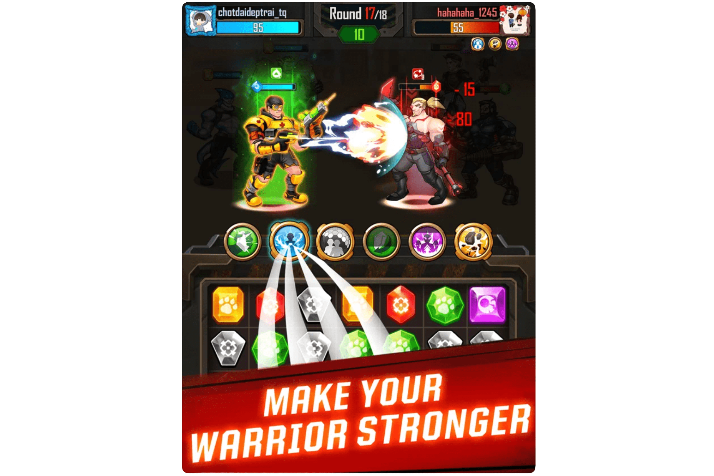

# The Wasted Lands

什么是荒芜之地？
The Wasted Lands 是一款开创性的科幻游戏，将多个令人兴奋的游戏元素融入到后世界末日元节 The Wasted-verse 中的角色扮演游戏中。凭借围绕其 Metaverse 生态系统的独特游戏功能，例如 Match 3 Puzzle RPG、Racing 和 Shelter Building 游戏，The Wasted Lands 配备齐全，可提供引人入胜的玩家体验。
荒原是一个包含三个大型游戏的奇幻虚拟世界，玩家将沉浸在一个充满冒险的世界中，穿越后世界末日的世界。玩家可以创建他们独特的勇士 NFT，享受广阔的元宇宙世界，其中包含许多令人兴奋的功能，如车辆和庇护所系统、融合和生成新的 NFT、三消游戏、宠物、土地和各种设备升级。
值得信赖的合作伙伴包括：库币； OKEX； Genblock资本；星火数字资本；外海;氪金集团；无限发射；冰茶实验室；马文资本；共智基金；以色列区块链协会； GD10 风险投资公司；马格纳斯资本； B21; M6;内核风险投资；索泰克；和水滴资本。
荒地游戏现已在
☑️应用商店
☑️谷歌播放
☑️电脑

