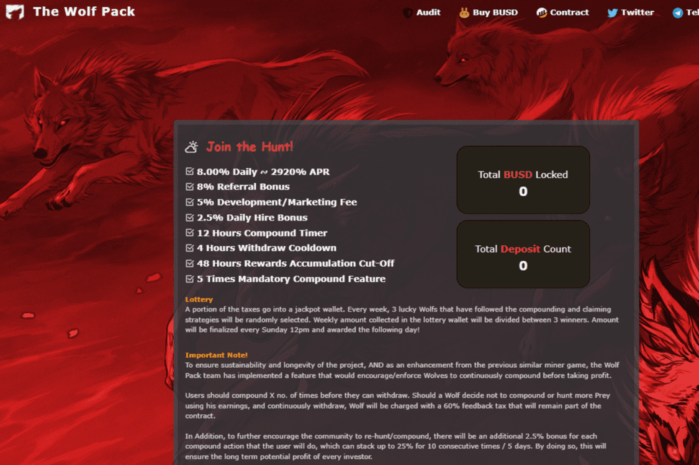

# The Wolf Pack

-8.00% 每日 ~ 2920% APR -8% 推荐奖金 -5% 开发/营销费用 -2.5% 每日雇佣奖金 审计：Audits.finance
Wolf Pack 是一个基于币安智能链的去中心化应用程序。 游戏的目的是比其他玩家更快、更频繁地捕猎更多的猎物。 这反过来又可以更快地为您赚取更多的 BUSD。 这些狼不知疲倦地为您工作，平均每天为您提供狼价值的 8%。

The Wolfpack 是 2015 年的美国纪录片，由 Crystal Moselle 执导。 这是关于安古洛一家，他们在纽约市下东区的公寓里在家上学和抚养六个孩子。 该片于 2015 年 1 月 25 日在圣丹斯电影节首映，并获得美国纪录片评审团大奖

