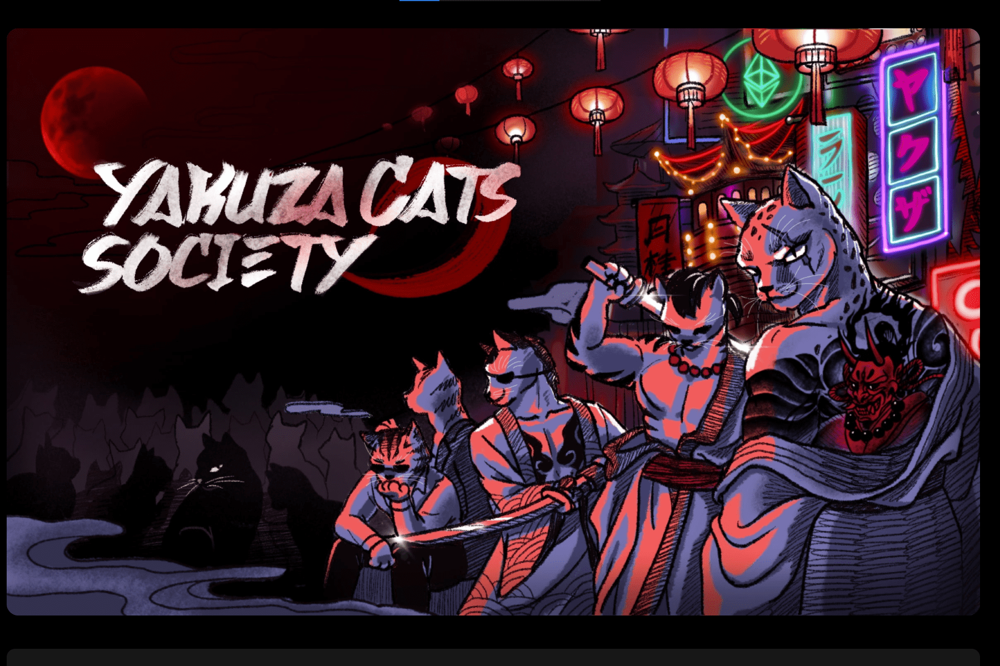

# The Yakuza Cats Society

Yakuza Cats Society 是 8,930 只具有 300 多种特征的 Yakuza 猫的独特集合。
黑道猫会第一任御侍老了，17岁就去世了。后来，过着猫狗生活的左右手分道扬镳。 他们在不同的地区都有各自的组织：一个在东京，一个在大阪，从那时起就一直在进行一场激烈的战斗，旨在统治整个日本。 通过质押黑帮猫加入您想要的集团，在该地区扩大您的集团，并成为统治全日本的黑帮亲文！

Yakuza Cats Society 是 8,930 只猫的独特集合，由算法生成，具有 300 多个特征。 Yakuza Cats Society 中有两个集团 - YaMEOWguchi-gumi 和 SuMEOWshi-kai。 每只猫都忠于各自位于不同地区的组织：一只在东京，另一只在大阪。

