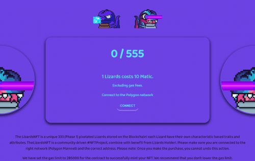

# TheLizardsNFT

LizardsNFT 是存储在#MATIC 上的独特像素化蜥蜴
  555 最大供应量（第二阶段）和 1111 最大供应量（第二阶段）
  每只蜥蜴都有自己的特点和稀有性。当前基于人脸、背景和身体
  第一阶段蜥蜴持有者将在手绘蜥蜴到来时获得部分空投1/1！
  前 100 名铸造 Lizards 的人将在 Discord 上获得一个 ALPHALIZARDS 角色，很快你就会从我这里得到一个神秘的惊喜！ThelizardsNFT是一个社区驱动的#NFTProject,结合了Lizards Holder的好处!请确保您连接到正确的网络和正确的地址。

