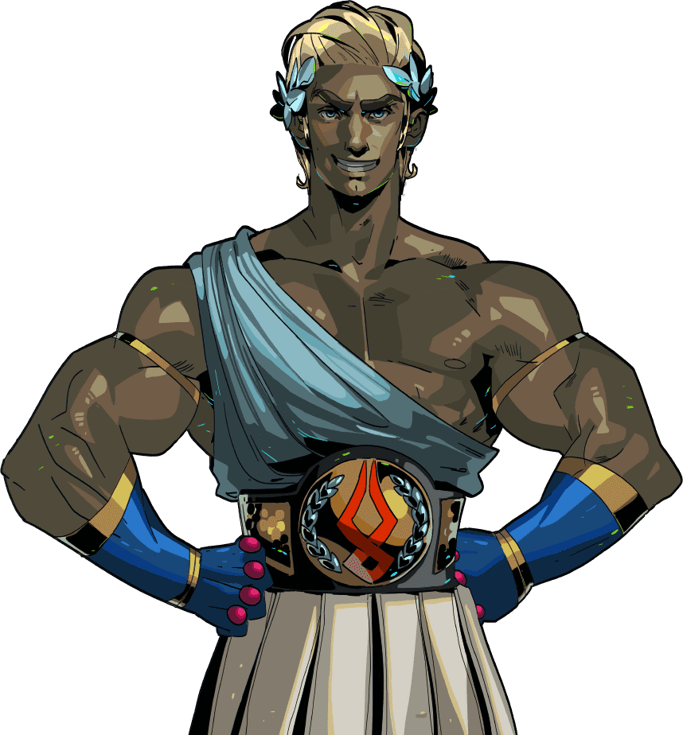

# Theseus

Theseus 是一个社区驱动的代币，以加密货币广告项目为用例。 该平台将成为忒修斯的收入来源，并将用于回购、销毁和营销。 简单的方法将使价格更加稳定，并为所有用户带来优势。 市场上的可用供应将通过回购和销毁方法定期减少，直到只剩下 50%。

忒修斯
维基百科，自由的百科全书
跳转到导航跳转到搜索
关于其他用法，请见“忒修斯 (消歧义)”。

忒修斯杀死了牛头怪，释放了一个雅典男孩；克里特人走近惊叹这一场景。庞贝古城的古色古香的壁画
希腊神话
Euboean双耳瓶，c。公元前 550 年，描绘了卡德摩斯与龙之间的战斗
神祇
原始泰坦奥林匹斯女神海神地球神
英雄与英雄主义

  
