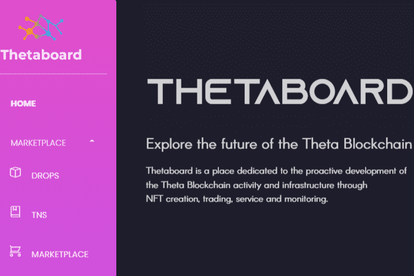

# Thetaboard

Thetaboard 是 Theta 名称服务 (TNS) 域的所在地，这是 Theta 网络上唯一可用的基于区块链的域。 Thetaboard 还托管用于代币社区质押的 Guardian 节点和 Elite Edge 节点、NFT 市场，以及用于监控质押回报的仪表板。

探索 Theta 区块链的未来
Thetaboard是一个致力于积极发展的地方
Theta 区块链活动和基础设施通过
NFT 创建、交易、服务和监控。

您可以在我们的 Delegate Elite 边缘节点上质押 Tfuel。 3% 的质押奖励费用（每赚取 10 Tfuel，Thetaboard 费用等于 0.3 Tfuel）。 使用下面的摘要并关注我们的常见问题页面。 如果您拥有超过 100,000 Tfuel，请在我们的 VIP 精英边缘节点上进行质押。 质押：10.0 K / 可用：490.0 K。

