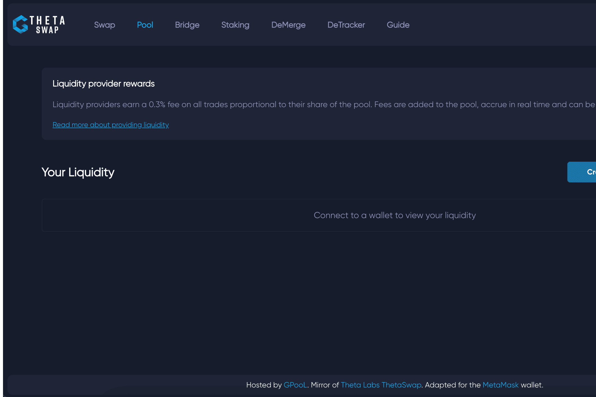

# ThetaSwap

ThetaSwap 是第一个建立在 Theta 区块链上的去中心化交易所，使用基于类似于 UniSwap 的自动做市商逻辑构建的开源智能合约系统。 它允许用户以无需信任、非托管的方式交换他们在 Theta 区块链上构建的新创建的 TNT20 代币。

选择一个令牌。 连接钱包。 由 Theta Labs ThetaSwap 的 GPooL.Mirror 托管。适用于 MetaMask 钱包。MetaMask 钱包。

ThetaSwap 使用您的 Theta Chrome 钱包与交易所进行交互。 您可以在此处下载以添加到您的 Chrome 浏览器。 要将您现有的 Theta 网络钱包或移动钱包导入 Theta Chrome 钱包，只需使用您在设置钱包时记录的 12 字助记词。

