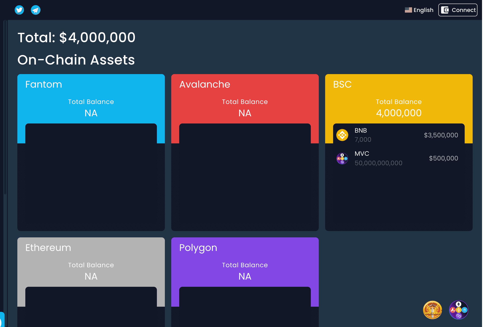

# Thoreum

Thoreum V2 是：

  无忧无虑：您在 BSC 上购买并放松。
  持有赚取：每次用户买卖时，6.5% 的税收分配给 BUSD 的现有持有者，6.5% 的税收累积在 Thoreum 国库中。
  超级通缩：每次买卖都会烧掉 3.5%。这导致超快的 $Thoreum 消耗率。由于 $Thoreum 在每笔交易中都会被烧毁，因此其总供应量将不断缩小持有人余额，而持有人余额则从每笔交易中获得奖励，并不断增加对 Thoreum 不断减少的供应量。这种内置机制对 $Thoreum 代币产生了真正的供应冲击，因为它随着时间和交易量变得越来越稀缺。
  多链农业：我们为多链农业带来了 8,000++ BNB，将这些资金质押以开始产生新的收入并将奖励返还给持有者。
  持续回购和奖励：利润将用于每日回购Thoreum - 提高价格 - 并直接分配给长期质押者 - 增加持有者的数量。

