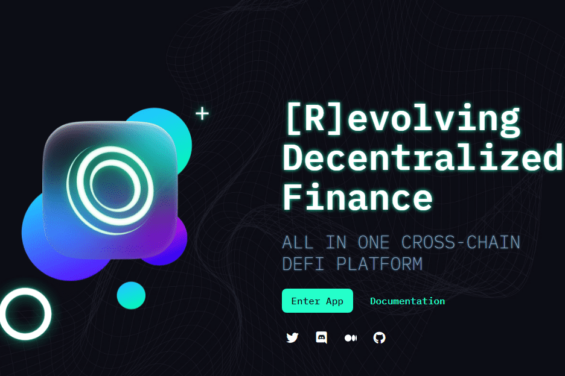

# ThorusFi

Thorus 是一个多合一的跨链 DeFi 平台，具有适应性强的资金系统和代币持有者优先的方法。 所有协议功能都旨在强化这种心态。 每个功能都是生态系统的一部分，该生态系统不断将价值带回 THO 代币，最重要的是使持有者和利益相关者受益。
该项目还旨在成为首批拥有协议拥有流动性的 AMM 之一。

Thorus 是一个多合一的跨链 DeFi 平台，具有适应性强的资金系统和代币持有者优先的方法。 所有协议功能都旨在强化这种心态。 每个功能都是生态系统的一部分，该生态系统不断将价值带回 THO 代币，最重要的是使持有者和利益相关者受益。

