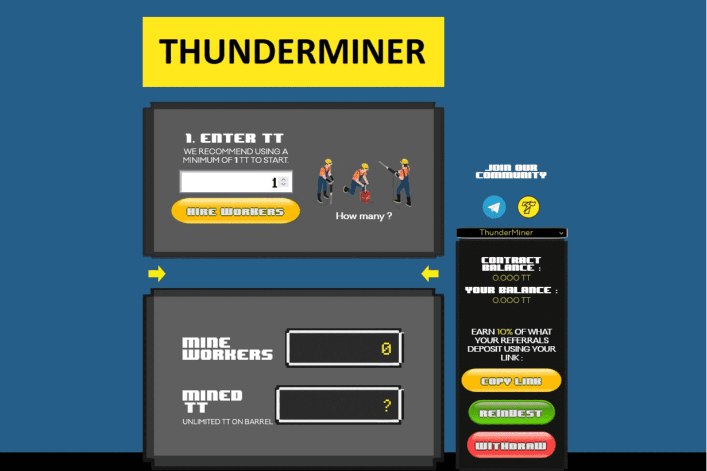

# ThunderMiner

什么是雷电矿工？
ThunderMiner 合约只是 BNB Miner 和 Crypto Egg 等最著名的挖矿 Dapp 的克隆。唯一的区别是 10% 的初始每日费率和开发费用，这里是每个传入或传出金额的 10%。原理很简单。您以可变价格购买工人。您购买的越多，您将越快挖掘合同上的 TT。当很多人购买工人时，他们变得更加昂贵。当人们撤回他们开采的 TT 时，工人变得更便宜。ThunderMiner 是一个去中心化的应用程序，它通过智能合约将投资者联系起来。该合约部署在 ThunderCore 区块链上，并独立于您是谁、您在哪里以及何时使用它而无休止地执行代码。一旦合约被部署，开发者就无法更改它。它也是完全透明的，可以在 scanthundercore 中读取。

