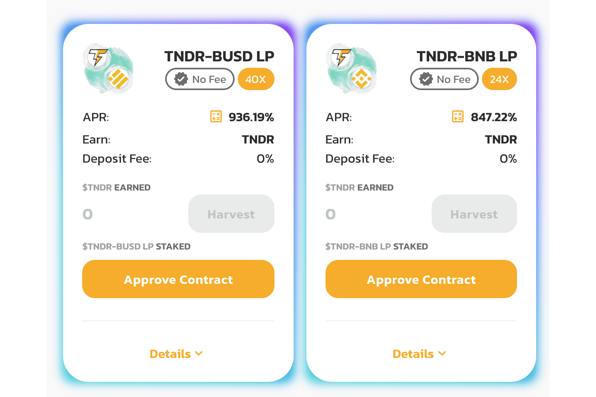

# ThunderSwap

ThunderSwap 是一个在 BSC 上具有自动减排、回购燃烧和链上推荐计划的下一代收益农场。 ThunderSwap 拥有雨水农场和云池，您可以通过质押您已经拥有的 LP 代币和其他代币来赚取 $TNDR 作为 ThunderSwap 生态的燃料。

立即从世界排名第一的加密货币价格跟踪网站获取最新的 ThunderSwap 价格、TNDR 市值、交易对、图表和数据

2022-02-15 - 今天 TNDR 的实时价格为 0.0037474 美元/（TNDR / 美元），当前市值为 0 美元。 24 小时交易量为 0 美元。 TNDR 到美元的价格是实时更新的。 ThunderSwap 在过去 24 小时内为 +0%。 它的流通供应量为 0 美元。

