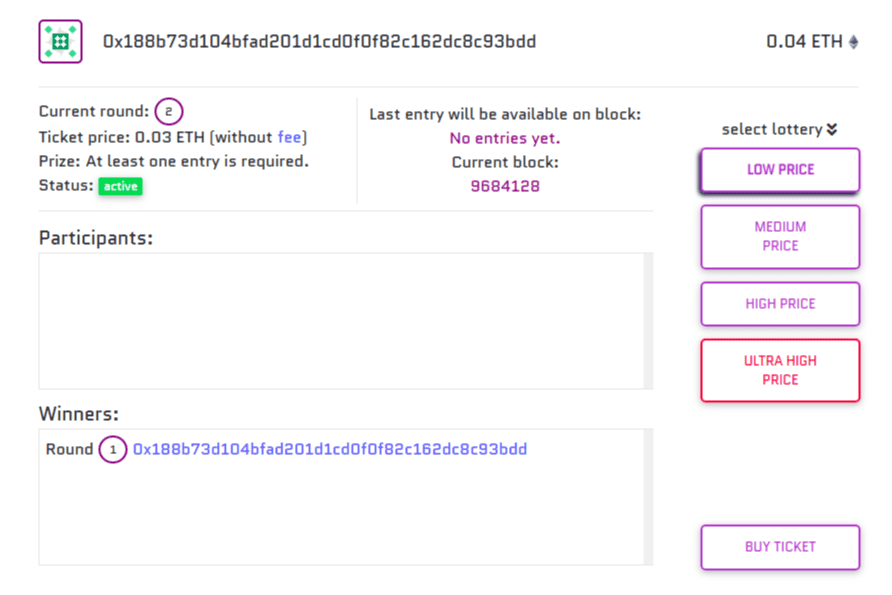

# Ticketh

规则：

- 每个玩家都可以购买多张门票。 （如果您不是唯一的玩家，请购买更多门票）
- 每个玩家都可以参与多于一张彩票。
- 购买第一张票时开始抽奖。
- 抽奖持续时间是开始时的当前块数+持续时间块。
- 一旦当前区块号达到彩票区块号，只能再提交一张彩票。
- 当最后一张彩票提交时，抽奖结束并选择获胜者。
- 获胜者由随机数决定，奖品在几秒钟内收到。
- 奖品在有超过一名参与者时计算。 10%的税是给彩票所有者的。
- 显示的奖品包括最后一个条目。

随机性：
不可预测的随机性是通过使用 Chainlink 去中心化预言机实现的。

