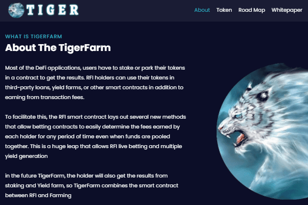

# TigerFarm

老虎农场 | $老虎
加密资金的未来
TIGER 与 RFI 合作，RFI 对每笔交易收取 2% 的费用，并立即将这笔费用分配给所有代币持有者。 代币持有者不必质押或等待费用发送。 费用由智能合约提供，并立即反映在持有人的余额中。
这个怎么运作
$TIGER 是在发布时完成的 RFI 智能合约。 没有ICO，没有预售，没有空投，
并且没有任何形式的筹款。 不能依赖任何个人或团队为 RFI 提供任何价值。
每笔交易将分为 2% 给持有人、2% Auto LP、1% 团队和营销

