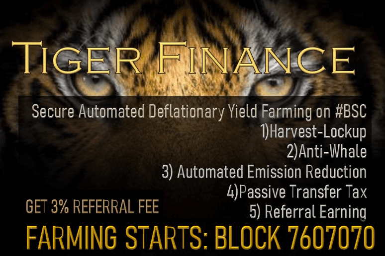

# TigerFinance

TigerFinance 是第三代自动通缩收益农场，具有反鲸鱼机制、丰收锁定、推荐收益、被动燃烧和减排。

交易规模
公司销售规模：50 至 10 亿美元以上
类型：收购融资、延迟提取定期贷款、周转/过渡资本、股权/资产扩充。
直接贷款 - 定期债务
一次性/债务收购
合作伙伴参与
股权/资产货币化
票据购买/过桥贷款

交易规模：5 至 50 美元以上
安全性：AR、库存、M&E、RE、IP/品牌。
高级贷款
FILO/第二留置权
分割留置权 / Unitranche

