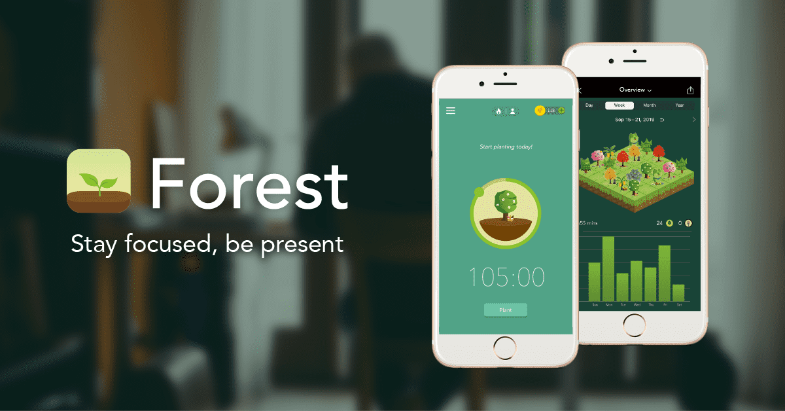

# Time Forest

Time Forest 是一款基于 EOS 的 DAPP 趣味焦点类效率软件。该产品旨在帮助用户放下手机，专注于当前的工作，同时利用区块链技术将你的“时间”转化为“金钱”。基本玩法：当用户想要专心做某事而不被手机打扰时，可以种下一株植物的种子，每一株植物都有不同的属性。种植前抵押相应数量的EOS，在种植过程中，会进入倒计时，同时，根据用户的选择，种植一棵带有独特标签的幼苗，在专注时间，小树会慢慢生长。这段时间的价值不仅会阻止你种下想要的苗，还会获得相应的PIP奖励。同时，您在聚焦时间前抵押的EOS将归还给您。 《时间森林》是一种积极的情绪引导和对专注时间的积极奖励，将植树、森林隐喻与人类最原始的情感结合起来，让大脑自然接受。如果你的注意力被打断，会有一个小的惩罚，促使需要时间集中精力的用户，或者想退出手机的人，把注意力集中在他们眼前的工作和学习上。

