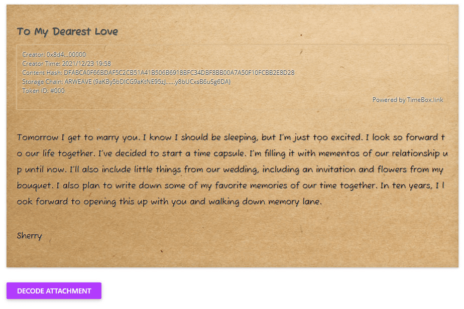

# TimeBox

TimeBox 的概念来源于时间胶囊的故事。这是一种古老的时尚。早在 1983 年，史蒂夫乔布斯就将他对未来技术的理解留在了一个时间胶囊中。 59 岁的约翰·卡佛相信世界上不会有颜色，并在他的时间胶囊里保留了许多物品，包括蜡笔。然而，他再也没有找到他的时间胶囊。
TimeBox 是为了回忆生活中的特殊时刻。您可以根据需要将所有内容记录到 TimeBox 中，并呈现给未来的一代，甚至是未来的自己。一种感觉，一封信，或者你孩子的微笑，以及你和他们在一起的时间。未来您的 TimeBox 收件人，无论是您自己还是其他人，都会很高兴看到您的历史。
由于互联网纯粹是集中控制的，我们无法提供这项服务。不能信任集中控制的 Internet 环境，因为无法保证数据存储和健康。区块链改变了世界。我们能够在成熟的公链形成的发展背后提供TimeBox服务。 TimeBox 会将您的数据永久存储在区块链上，不会造成数据损坏或丢失。您可以享受除全球互联网崩溃的极端情况外的服务。
您可以为 TimeBox 设置最长 10 年的锁定时间。在锁定期间，您无权查看任何内容。 TimeBox 可以链接到数字钱包并像任何其他数字资产一样存储。除非您决定将您的 TimeBox 发送给其他人，否则您始终可以放心。根本不会有任何损失或损坏。

