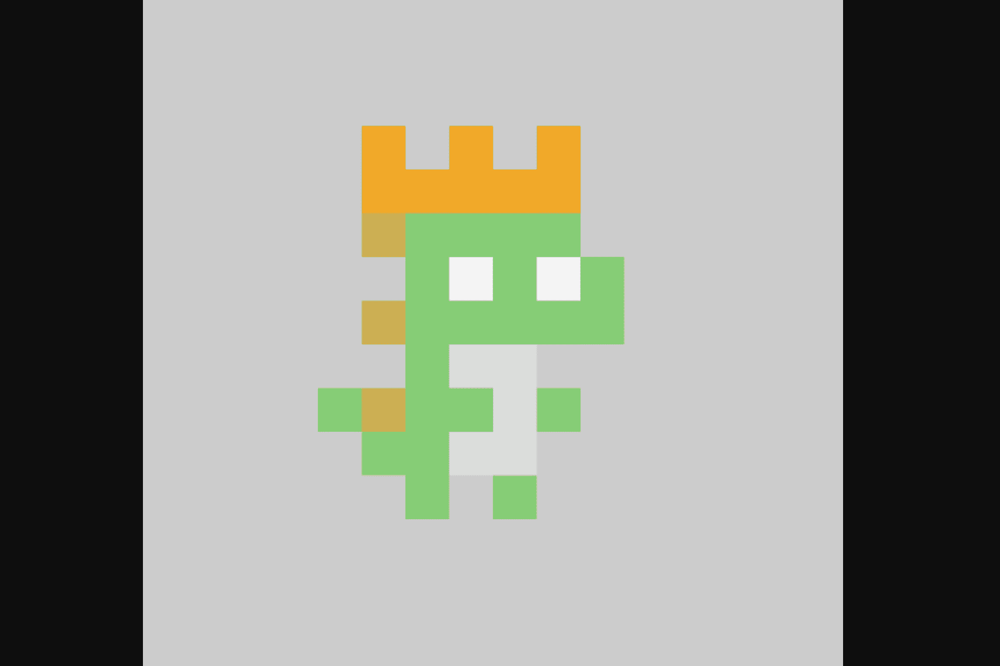

# tiny dinos (eth)

Tiny Dinos（仅限 ETH） 10,000 个 CC0（Creative Commons）全链 NFT 在 7 条不同的链上铸造并可在每条链之间转移。该项目的收藏品是免费铸造的。 Tiny Dinos 是一个 CC0 项目，没有路线图或不和谐，只有小恐龙和跨链互操作性。与第一个全链 NFT Gh0stly Gh0sts 类似，Tiny Dinos NFT 存在于 Ethereum Mainnet、Polygon、Arbitrum、Avalanche、Binance Chain、Optimism 和 Fantom 上。

这是全链 NFT 提供的示例：

“假设有一个名为 Ligma 的 NFT 收集器。Ligma 决定在 Avalanche 上铸造他的 NFT，也许是为了节省一些汽油费。他后来决定他想在 Twitter 上使用他的 NFT 作为他的 PFP（目前只支持以太坊主网）验证），所以他在 Avalanche 上使用了启用 Layer Zero 的 功能，目的链设置为以太坊。这次遍历的结果是官方的以太坊 Tiny Dinos NFT。Ligma 的 NFT 现在可以被主网验证为资产Tiny Dinos 以太坊合约。”

