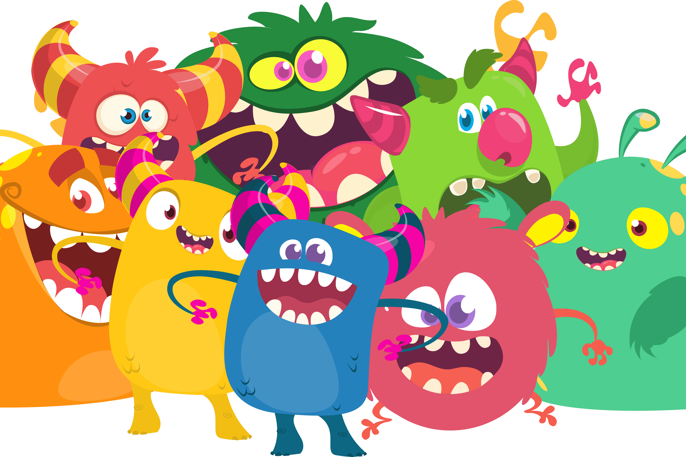

# Tiny Titans

泰坦之战
Tiny Titans 是 NFT，您可以收集、交易和发送到彼此的战斗中——所有这些都在部署的智能合约的逻辑中分散发生。每个微型泰坦在铸造时都从一级开始，但会收到一组随机的属性值 - 使每个微型泰坦 100% 独一无二！
铸造你的泰坦
每个人都可以在钱包里铸造一个新的 Tiny Titan - 如果这个钱包还没有一个 Tiny Titan。铸造一个新的 Tiny Titan 只需要 0.25 BNB。
在铸币厂，每个 Tiny Titan 都从第一级开始，一组随机的属性值和代表它的独特艺术品。
战斗和等级
要提升你的小泰坦等级，你需要与其他小泰坦战斗。不管你输赢，你总会得到经验——你会因为赢而获得更多的经验。如果您想快速升级您的微型泰坦，您可以通过与您事先查找的特定微型泰坦进行战斗来增加获胜的可能性，或者通过为您的微型泰坦添加通电来提高其属性，然后再攻击其他人。
交易和收集
每个微型泰坦的拥有者都有可能出售他的微型泰坦。为此，他为他的收藏品设定了价格，这将把它添加到我们的待售微型泰坦列表中。拥有者在他的微型泰坦尚未售出的情况下仍然可以与其他人战斗。如果他改变主意，所有者可以随时取消出售要约。

