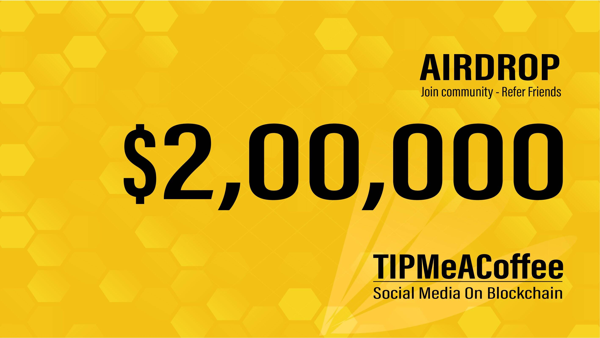

# Tip Me A Coffee

TipMeACoffee 是一个社交媒体 dapp，用户通过分享和点赞获得奖励。 这是一个完整的基于 web3 的社交网络，您可以在其中分享以赚取收益。 TipMeACoffee 社交媒体 dapp 由微风 DAO 发起，在侧链（微风）上开发，其代币 TMAC 在 BSC（Binance 智能链）上作为 BEP20 代币。
与任何其他社交媒体网络一样，用户可以共享网络链接、视频及其状态等内容。 对用户帖子的每一次点赞都会获得 TMAC 代币。 用户可以将这些 TMAC 代币从他们的 TipMeACoffee 内部钱包中提取到 BSC 上的 BEP20 TMAC 代币。

