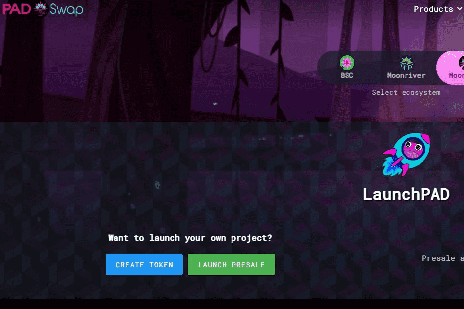

# TOAD.Network

TOAD.Network 是一個公用事業生態系統和一個社區驅動的組織，旨在解決去中心化金融的常見問題。這些問題包括不同形式的流動性無法以分散的方式與市場聯繫；甚至是從項目中移除流動性供應的問題（Rug-Pulling）。一些解決方案為解決流動性問題提供了漸進式的進步，但 TOAD.Network 的進步旨在啟動更廣泛、更有影響力的網絡效應。 TOAD.Network 並沒有將自己局限於單一的解決方案，而是將許多分散的市場和工具交織在一起。
迄今為止，核心產品；包括獨特的反地毯 LP 激勵協議 (DPLP)、在 BSC、Moonriver 和 Moonbeam 上運行的多鏈去中心化交易所/AMM (PADSwap.Exchange)、永遠上漲的價格底線掛鉤指數支持系統 (The Vault)、獨特的滴灌收益農場（Farms），以及一個新的代幣 Launchpad（LaunchPAD），以及一個 GameFi 工具學習中心（TOAD Academy）。 TOAD.Network 的產品配置方式允許整個平台維持 TOAD 代幣持有者的去中心化治理，同時繼續在集體基礎上進行創新。

