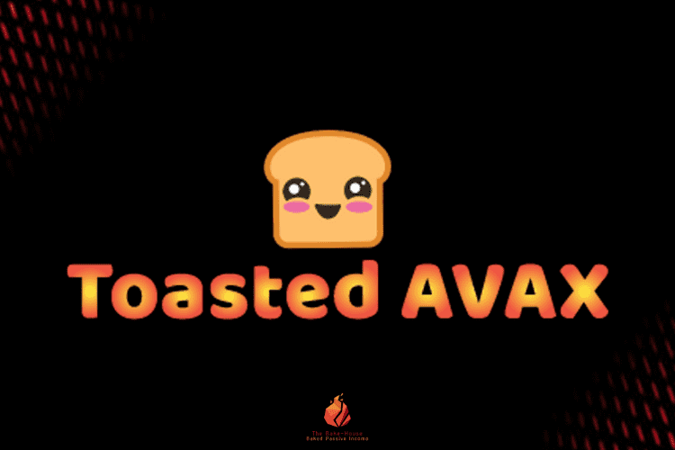

# Toasted AVAX

Toasted AVAX 是 Token Miner 元数据的有趣旋转。
它是一个简单的智能合约，充当 AVAX 奖励池，只要合约中仍有 AVAX 锁定，每天都会返回池中 5%* 的 AVAX！ 用户可以选择吃他们的吐司（拿走他们的 AVAX 奖励）或在他们积累时重新吐司他们的 AVAX（复合获得的 AVAX 奖励）。
干杯您的 AVAX，玩得开心，享受您的 AVAX 奖励！

Toasted AVAX 如何可持续发展？
Toasted AVAX 与所有其他加密货币、代币或项目一样，得到持续的社区支持。不同的是，既然没有代币，就没有价格可以抛售。只要吐司在合约里烤，就有奖励！

如何在我的手机上使用 Toasted AVAX？
您可以使用带有 dapp 浏览器的应用程序并选择 Metamask/Injected 选项，或者只需使用您想要的任何浏览器并选择 WalletConnect 以连接到手机上的钱包应用程序。

