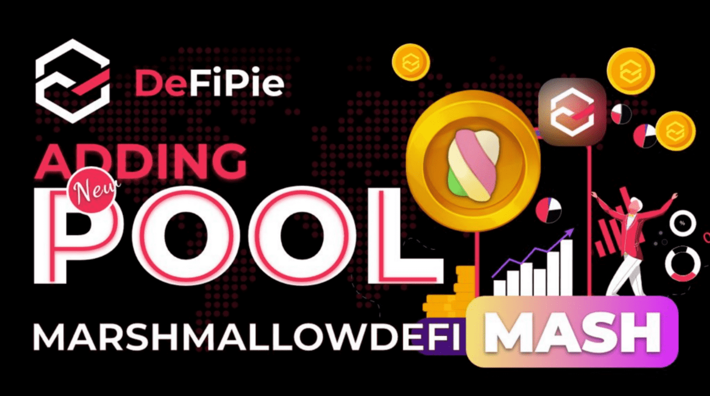

# TOFFEE SAFEFARM

什么是太妃糖安全农场？
TOFFEE SAFEFARM 是 BSC 上第一个用于再膨胀代币的 YIELD FARMING……它是一个促进复合自动化和单产农业的平台。

TOFFEE 使用各种策略来帮助用户通过自动化来增加资产。

优化组合的 TOFFE SAFEFARM 旨在最大限度地降低 HotVaults 中的天然气成本和长期农业，并在 TOFY 中表达了有利的激励措施，以吸引新的储户并为 TOFY 持有者带来额外的长期奖励。此外，SAFEFARM 用户不需要彻底了解 支持自动化和产量优化的底层协议

