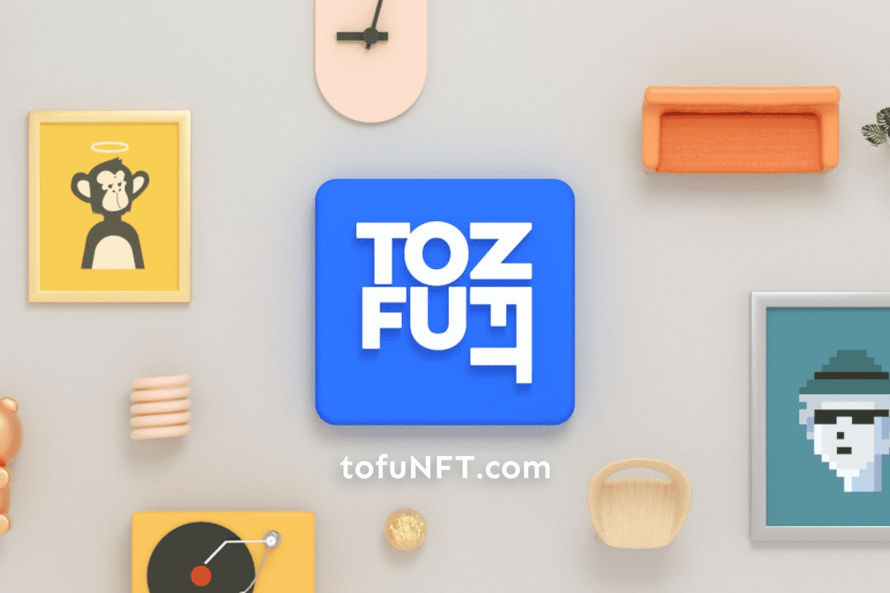

# tofuNFT

什么是豆腐NFT？
NFT 市场专注于 GameFi 和收藏品。 tofuNFT 是一个功能齐全的去中心化市场，用于购买、销售和交易 NFT，由 SCV.Finance 创建并部署在多个区块链上。

TofuNFT — 第一个 Omnichain NFT 交易所
到目前为止，当您想将 NFT 遍历到其他链时，您需要直接调用智能合约，如下面的带有专用 chainID 的推文。每个人都不容易，尤其是不熟悉加密货币的人。

