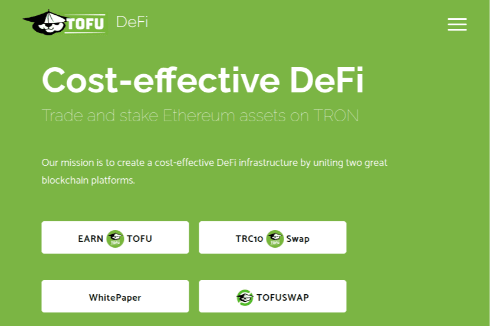

# TofuSwap

TofuDefi 是一种无需许可的去中心化 DeFi 解决方案，它将结合多个独立的 DeFi 协议。 第一个是 TofuSwap。 TofuSwap 是一种用于在 TRON 网络上自动进行代币交换的协议。 TofuSwap 基于与常量产品 Uniswap 协议相同的想法，但进行了一些改进以使交易者和流动性提供者受益。
TofuDefi 代币（TOFU）是一种 TRC-20 资产，赋予 TofuDefi 项目的社区治理能力。 TOFU 代币的持有者将能够对 TofuDefi 协议的所有变更进行辩论、提议和投票。
如果您有 TOFU，您可以在 TofuSwap 上以低于标准 0.3% 的费用进行交易。 根据您拥有的 TOFU 数量，您可以在 Tofuswap 上获得 0.25% 到 0.1% 的交易费。

