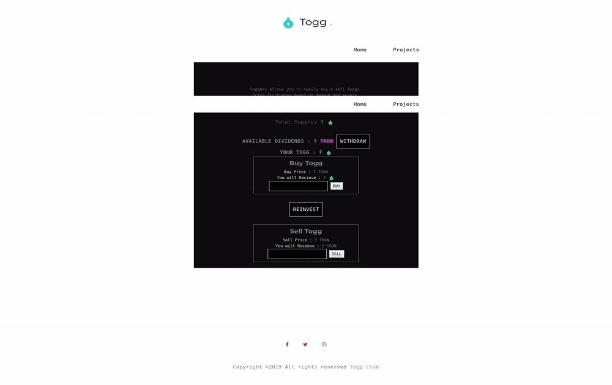

# Toggdex

什么是 Toggdex？
tron 网络上的游戏红利分发代币。

Toggdex 是一个基于 Tron 的代币分发平台。您可以玩游戏并获得奖励。或者您可以投资该平台并赚取红利。这是你的选择。无论您选择哪个选项，您都可以获得收入。

Toggdex dApp 是一种基于Tron协议的高风险类别的加密资产。现在，根据用户数量，它在一般 dApp 排名中排名第 4905位，在高风险类别中排名第 1311位，这让您可以很好地了解Toggdex dApp 在其竞争对手中的表现。

通过分析最近 30 天窗口内的 Toggdex dApp 数据，可以看出 dApp 的Balance为$ 0.06，Volume稳定在$0.00。Toggdex在 30 天内产生了0 笔交易，变化为 0%。显然，与之前的 7 天相比，成交量稳定了0% 。最近 7 天的数据显示，Toggdex用户基数为0，稳定了0%。

我们还建议查看Toggdex 活动概览和智能合约余额图表，了解这些重要指标如何随时间波动和变化。

