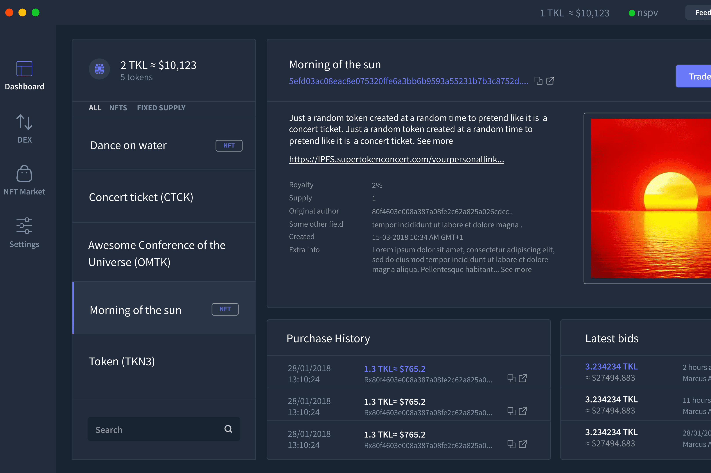

# Tokel Platform

什么是通证平台？
Tokel all-in-one Superlite 应用程序使用新的 nSPV 技术，并将具有硬币钱包、代币钱包、代币浏览器、tokenDEX、NFT 市场和简单易用的代币创建工具。

Tokel 区块链使用智能 UTXO 技术，尽管功能不完全相同，但与智能合约具有相似的特征和显着优势。

轻松创建 NFT 和代币。
没有复杂的智能合约。
没有汽油费。
Tokel UTXO 链使每个人都可以轻松、可访问且便宜地进行代币化。

