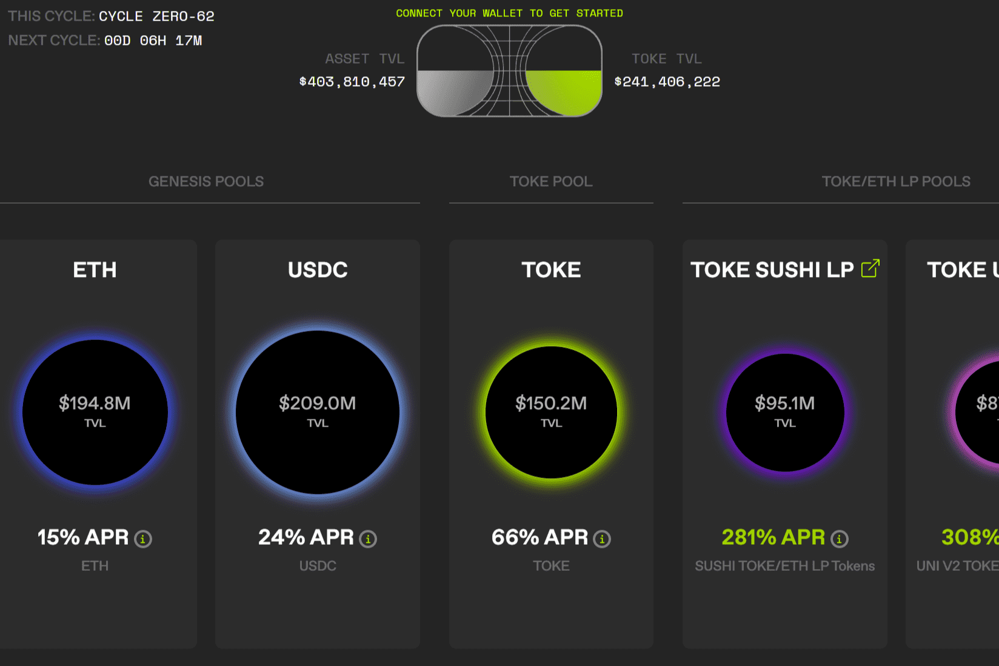

# Tokemak

Tokemak 通过方便的去中心化做市协议创建可持续的 DeFi 流动性和资本效率市场。
可持续流动性包括几个因素：

   可持续生产——不受通货膨胀的影响
   民主采购
   资本效率
   超级流动——流向最有利的市场
   鼓励资产的深度积累以减少滑向零

我们认为，流动性挖矿一直是一种宝贵的资源，并且在 DeFi 短暂历史的早期阶段非常成功地引导流动性。

DAO 及其代币持有者仅将他们的代币存入代币反应器，以创造市场流动性并防止无常损失。

代币反应器中的代币与配对反应器中的资产（例如 ETH）配对，并根据流动性董事的投票部署到 DEX。

流动性提供者和流动性主管通过将资产存入 Reactor 或投票 TOKE 以引导流动性而获得奖励。

