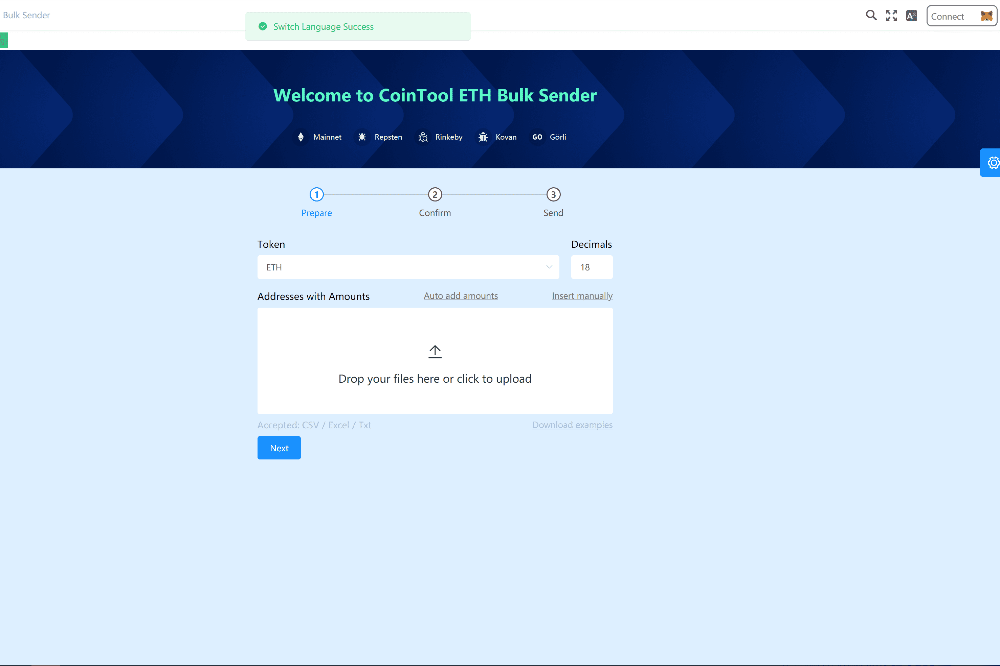

# Token Batchsender

什么是令牌批量发送器？
问题：以前，在以太坊网络中，需要额外的工具来同时发送许多 ERC20 代币。 很多人还是一个人手动发送，既费时又容易出错。 解决方案：此应用程序允许用户在几分钟内以极少的交易将代币发送到数千个地址。 每次发送的代币数量为 1 到 200，大约为 200。当您单击确认时，将自动向工具生成一笔交易，允许用户通过将其私钥的信任委托给 MetaMask 钱包。

