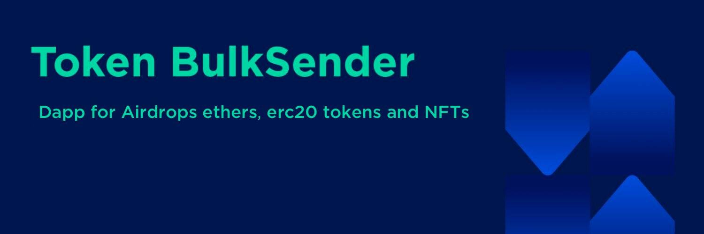

# Token Bulksender

什么是 Token Bulksender？
这是一个 dApp，用于通过少量交易将以太币和 ERC-20 代币批量发送到多个地址，这将为您节省更多时间和 tx 费用

Bulksender 现在生活在#Cubechain 上🚀

您可以在一笔交易中向多个地址批量发送 $CUBE、CRC-20 代币和#NFT！

Bulksender 现已上线

⚡️您可以在#Optimism（闪电般快速、低成本的 L2 区块链）的一次交易中将 $ETH、ERC20 代币和#NFT 批量发送到多个地址。

如果您想节省代币分发的汽油费（$ETH、ERC-20 代币、NFT（ERC-721 和 ERC-1155）），只需使用它即可。

