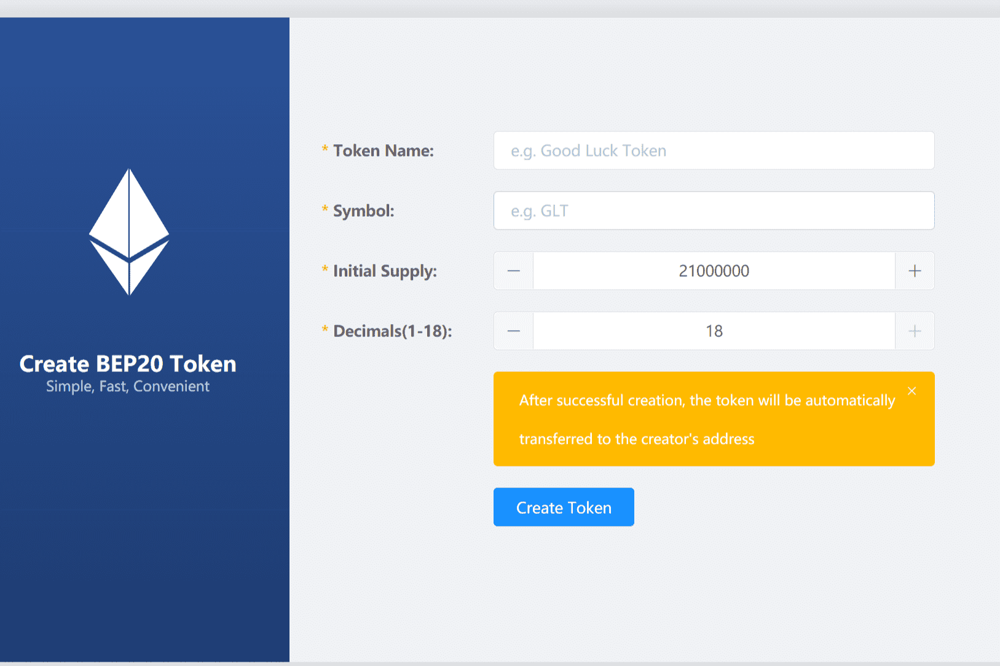

# Token Create BEP20

什么是 Token Create BEP20？
一键创建您的 bep20 令牌，无需登录

它有效地在 dapp 和 metamask 之间创建了防火墙！
NFT、DEFI用户使用可以有效防止钓鱼、诈骗等网站保护您的资产！

Cointool 批量搜索 ENS 名称是一个以太坊名称服务 (ENS) 批量搜索工具。 很容易找到。 可用于注册或在 OpenSea 上的 eth 名称。 #ENS

如何创建代币？
1.打开一个网站https://cointool.app/createToken/bsc
2.连接钱包
3.填写要创建的token信息
4.创建成功并添加到自己的钱包资产展示
5. 完成

BEP20 通缩代币部署在币安智能链上
Dapp：https://cointool.app/createToken/bsc
功能：
1.回购税（如$RISE）
2.持有人奖励税
3.Lpool税（如$SAFEMOON）
4.交易税
5.烧税
只需 1 分钟即可创建您自己的代币！
快来创建你自己的 bep20 代币吧！

