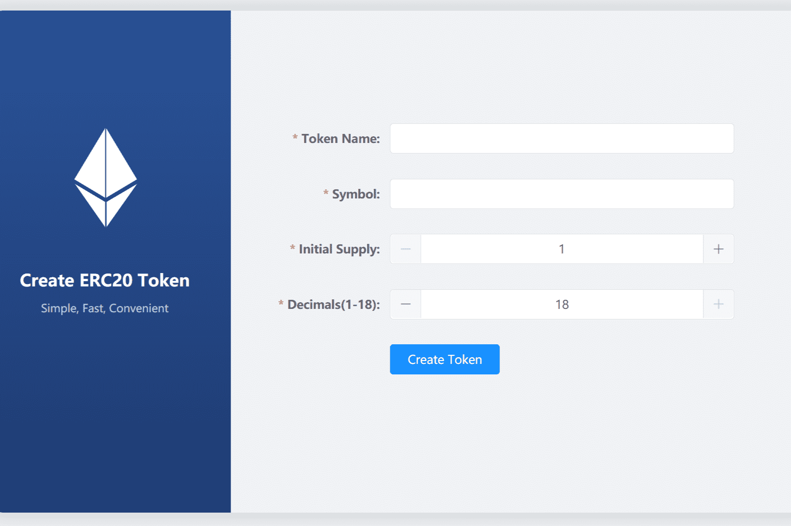

# Token ERC20 Generate

什么是 ERC20 代币生成？
您无需登录即可一键创建您的erc20代币。您可以自定义名称、符号、总金额等

无需编码即可创建您自己的 BEP20 智能合约。 BEP20 生成器是在币安智能链网络上创建自己的 BEP20 代币的最简单、最快捷的方式。 不需要编码技能。

Binance Smart Chain 是一个基于区块链的平台，提供低费用、快速交易时间和智能合约兼容性。币安智能链专为智能合约和去中心化应用程序（DApps）的创建而设计。

BEP-20 代币是基于区块链的资产。BEP-20 代币是在币安智能链上运行的智能合约。它们可以像任何其他加密货币一样发送和接收。BEP-20 标准提供了这些资产必须如何发送、接收和存储的规范。

