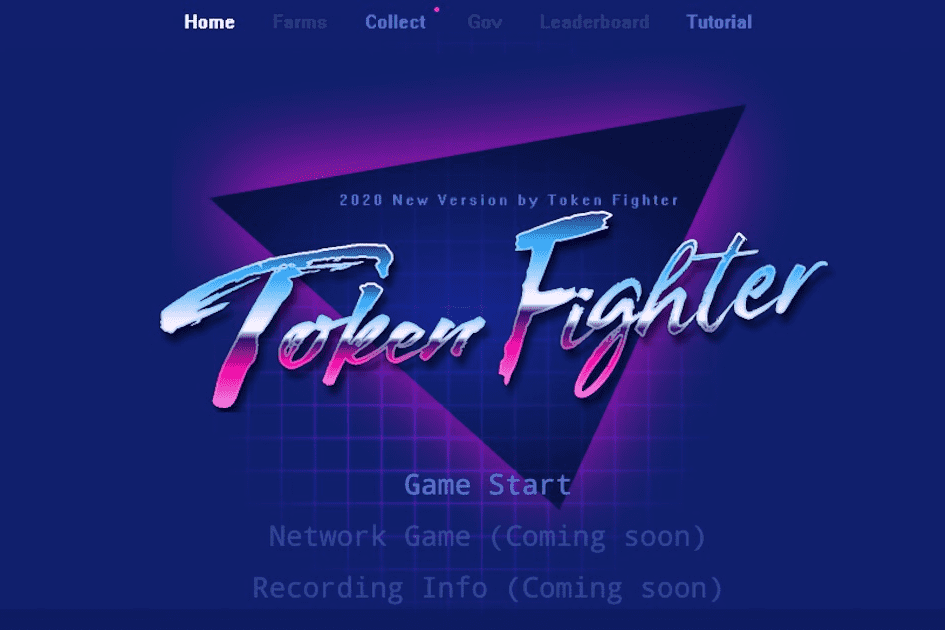

# Token Fighter

什么是令牌战斗机？
Token Fighter 是一款多人 NFT（Non-Fungible Token）收藏游戏，它结合了 DeFi 质押机制，以使代币持有者进一步参与维持 Token Fighter 代币经济和治理的未来。

Token Fighter 的成功很大程度上取决于用户的采用，我们相信流动性和 NFT 挖矿（即治理代币的分配）可以成为获得新玩家和收藏家的重要策略。但是，在代币分发和智能合约审计完成之前，我们不会启动任何形式的质押机制。

尽管如此，我们的团队将采取多方面的方法，为 Token Fighter 游戏玩家和收藏家创造更多价值。我们必须接受社区反馈并采用生态系统战略来促进可持续的代币经济并协调逐步过渡到去中心化治理。

