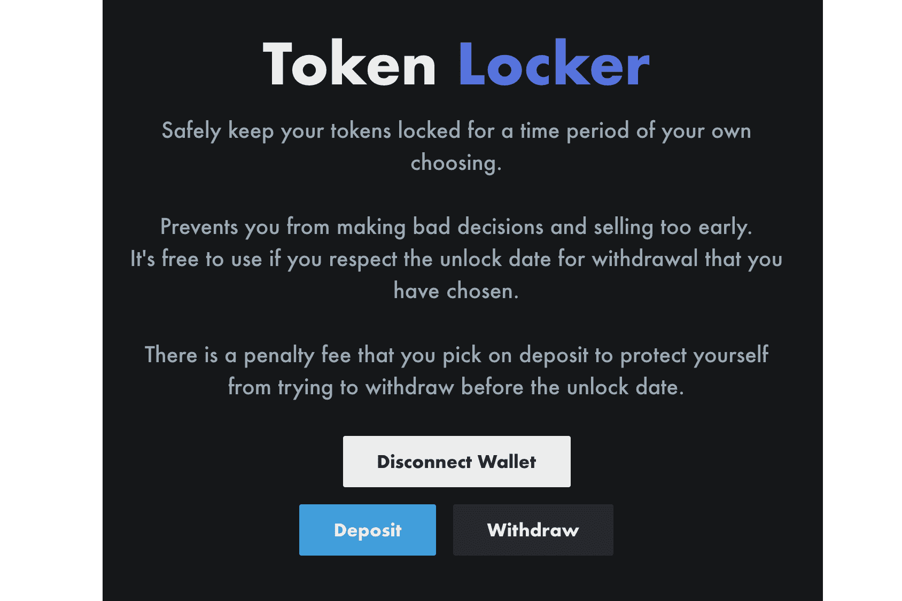

# Token Locker

什么是令牌储物柜？
在您自己选择的时间段内安全地锁定您的代币。 防止您做出错误决定和过早出售。 如果您尊重您选择的提款解锁日期，则可以免费使用。

您选择存款时会收取罚款，以保护自己免于在解锁日期之前尝试提款。

通过将您的代币存入一个时间锁定的智能合约钱包，您可以防止市场波动影响您的长期投资决策。

在您设置的存入通行证时间段之后，您将能够提取您的代币，唯一的成本将是交易气体成本。

如果您改变主意并想在不遵守锁定时间段的情况下立即退出以阻止用户，则将收取 20% 的费用。

