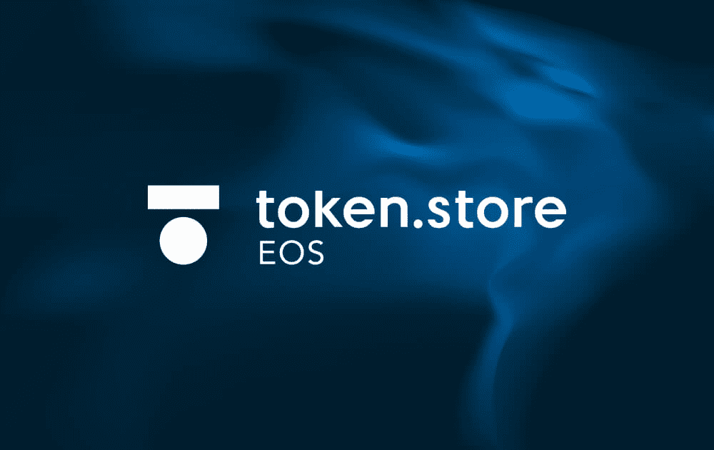

# token.store EOS

token.store EOS 是第一个完全无需信任的基于 EOS 代币的去中心化交易所。 token.store EOS 提供完全链上交易体验，所有交易都由经过审计的智能合约促进，从而消除了其他 EOS “DEX”面临的许多安全风险。 token.store EOS 的去信任性是通过交易所的链上订单簿、托管、匹配、结算和上市来保证的。 直接从您自己的钱包进行交易，费用为 0%，交易在 0.5 秒内结算。 token.store EOS 由 token.store ETH 的创建者带给你——以太坊上首批无需信任的交易所之一，自 2017 年开始运营并托管了 65 万笔链上交易。

