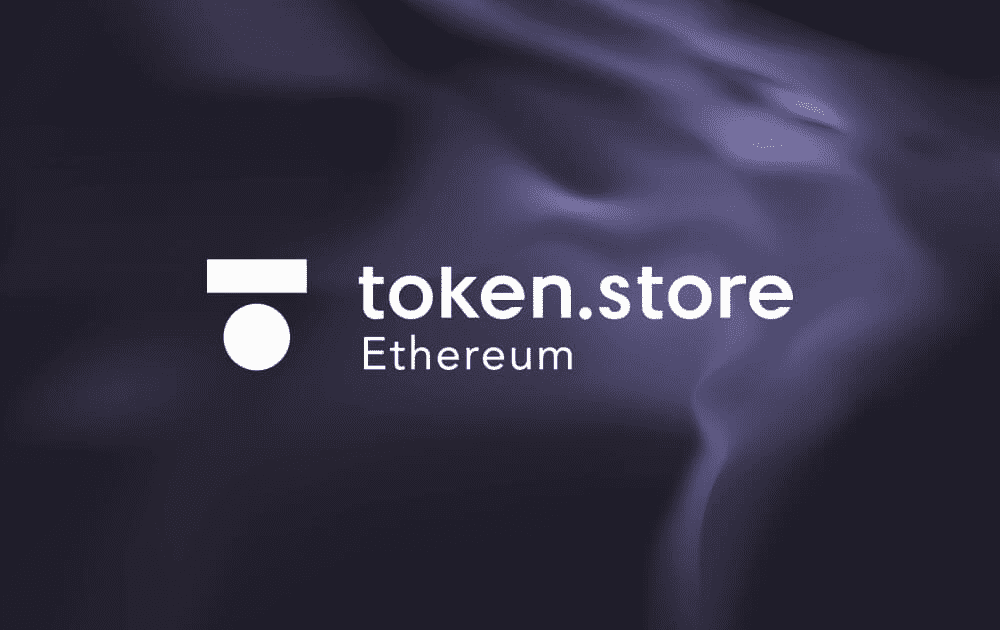

# token.store ETH

什么是 token.store ETH？
token.store ETH 自 2017 年开始运营，是以太坊网络上最古老、完全无需信任的去中心化交易所之一。 所有资金都保存在一个开放的智能合约上（而不是由交易所持有），从而消除了中心化和半去中心化交易所面临的许多安全风险。 token.store ETH 具有链上结算和链上撮合功能。 通过地址交易功能，任何代币都可以在 token.store 上进行交易，即使没有上市。 token.store 还在 EOS 网络上运营一个无需信任的交易所。

