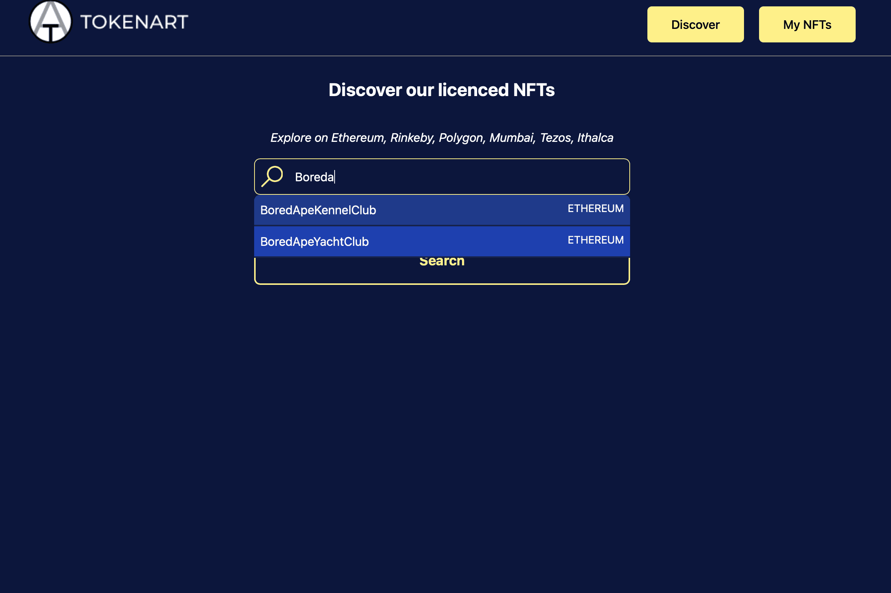

# Tokenart

什么是代币艺术？
智能合约引用 NFT 的版权

Tokenart 是一个由大学研究产生的开源和去中心化项目，允许创建者发行安全和合法的 NFT。它允许所有用户以去中心化的方式参与 NFT 市场的掠夺。它还提供了一个标准，允许 NFT 创作者告知他们的社区他们希望分配给他们的创作的权利。Tokenart 的灵感来自于 Lawrence Lessig 发起的知识共享工作，旨在通过 NFT 更好地管理互联网上的权利转移。

该项目最初专注于 NFT 的创建以及创建者创建合法、符合 NFT 并能够在任何兼容 ERC721 / ERC1155 的平台上出售它的可能性

通过我们的标准对创作进行标记的简单事实为创作者提供了可在法院面前反对的作品的亲子关系的法律证明。然后，我们的标准允许创建者选择他选择通过他的 NFT 提供的知识产权。

