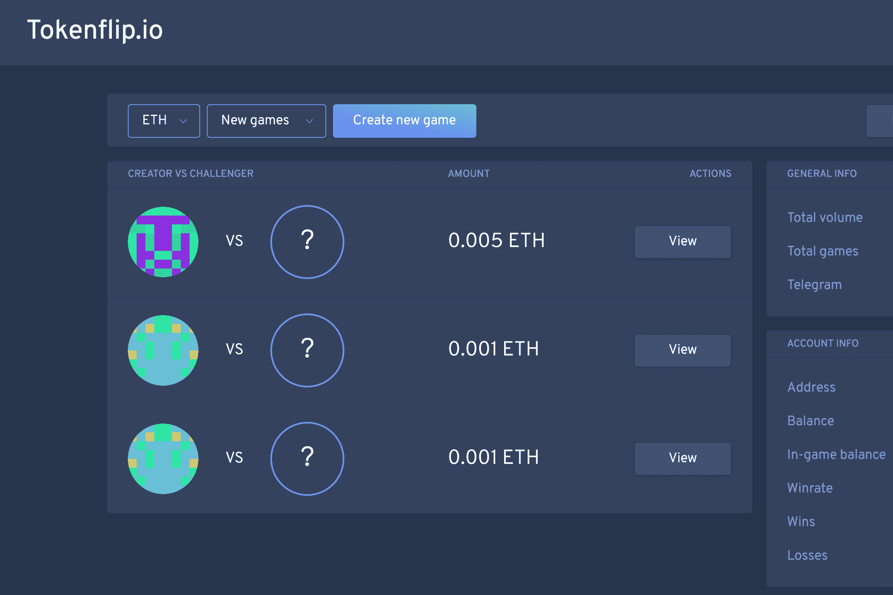

# Tokenflip.io

什么是 Tokenflip.io？
dApp 存在于 Polygon（以前称为 Matic）上，目前仅支持 ETH 游戏，但我们很快将能够支持其他代币，例如 MATIC。 您可以访问常见问题解答下的文档，了解有关桥接 Polygon 的更多信息。

为了玩游戏，您需要存入至少 0.01 ETH，这将成为您的“游戏内余额”。 请记住，有 1.5% 的费用，但之后您可以免费创建和玩所有您想要的游戏，无需任何费用。 每场比赛的最低投注额为 0.001 ETH。

与任何人玩投币游戏，赢取 ETH 和 ERC20 代币！
由 Chainlink VRF 保护并由 Polygon 提供支持。1.5% 的押金。

