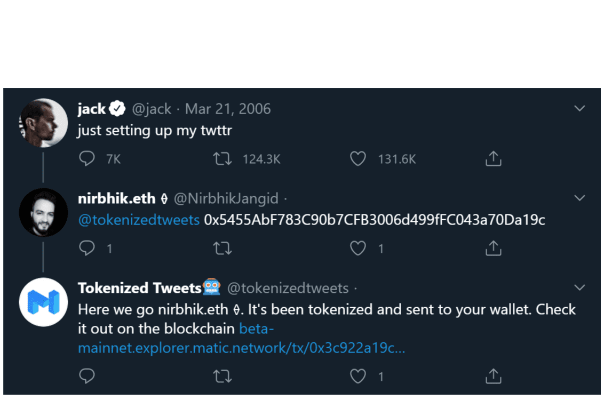

# Tokenized Tweets

什么是标记化推文？
只需在 Twitter 上回复特定推文，同时标记@tokenizedtweets，Matic Network 就会生成一个包含推文内容的 NFT。

有一个内置的游戏化元素，一条推文只能被标记一次。 一旦被拿走，它就消失了，没有其他人可以拥有相同的推文 NFT。这是任何人都可以在区块链上保存他们最喜欢的推文的一种方式.

NFT是非同质化代币（英语：Non-Fungible Token，简称：NFT），是一种被称为区块链数字账本上的数据单位，每个代币可以代表一个独特的数字资料，作为虚拟商品所有权的电子认证或证书。由于其不能互换的特性，非同质化代币可以代表数字资产，如画作、艺术品、声音、视频、游戏中的项目或其他形式的创意作品。虽然作品本身是可以无限复制的，但这些代表它们的代币在其底层区块链上能被完整追踪，故能为买家提供所有权证明。]诸如以太币、比特币等加密货币都有自己的代币标准以定义对NFT的使用

