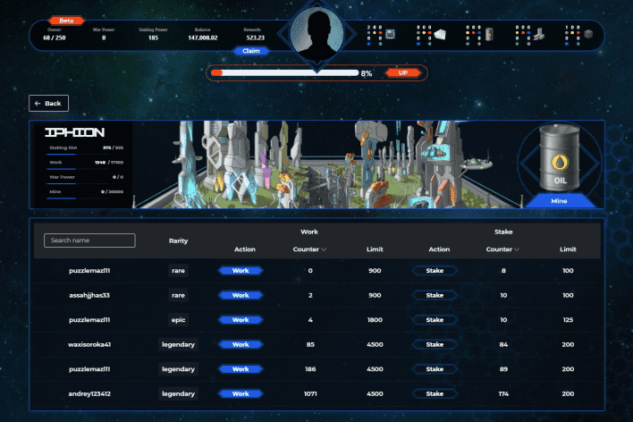

# TokenLands

TokenLands 是一个结合 WAX 区块链和网络游戏的新世界殖民经济 P2E 模拟器。基于游戏的游戏使用独特的 NFT 卡集合，包括基础设施、土地、头像、头像升级、资源和以战争为主题的 NFT，让玩家沉浸在一场激动人心的财富和霸权斗争中。
TokenLands 目前活跃的实用工具是激活部门、质押 NFT 卡、工作 (Play2Free)、采矿、银行和工艺。

  激活部门：部门所有者可以激活他们的 NFT 并获得被动收入，从他/她部门发生的所有事情中获得 10%。放样卡和工作。根据稀有度，扇区可以放置的卡片数量最多，每天的工作数量也最多。
  质押 NFT 卡：玩家可以质押这些质押卡，他们将获得被动收入。
  工作（Play2Free）：TokenLands 具有游戏赚钱功能。所有拥有 WAX 钱包的用户都可以工作并获得 0,3 T-coin 一份工作；需要8个小时。
  矿山：每个大陆都有自己独特的资源，可以通过参观矿山获得。参观矿山花费 3 T 币，需要 8 小时。收集神话般的NFT卡“战争工厂”需要资源。制作一个神话般的 NFT 需要五种资源中的每一种 300。战争工厂 NFT 卡是 50 枚 T-coin 预/日能量和铸币战争主题 NFT 的质押卡，需要参与战争。
  银行：玩家可以将他们的 T-coin 存入银行，他们将根据存入的时间（1 周至 12 周）获得一定的百分比，并有机会获得包含头像的奖品包和升级。

