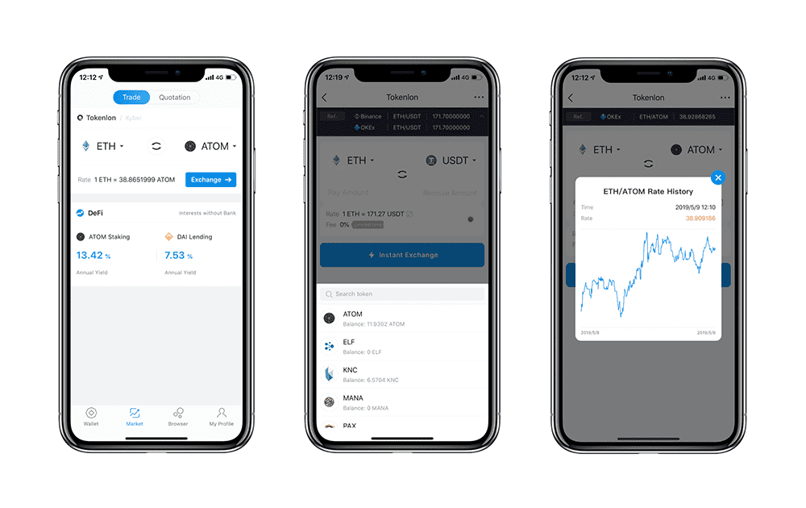

# Tokenlon

打开 imToken 或 Tokenlon.im 并点击“市场”在 Tokenlon DEX 上交易。 Tokenlon 是一个去中心化的交易所，具有链下限价单和基于 0x 的链上结算以及来自 Uniswap 和 Curve 等其他 DEX 的聚合量。 其模块化设计可防止抢先交易和交易冲突，使其： - 快速交易：由于链下报价提供了可以在一个区块内最终确定的最终价格。 - 易于使用：当用户看到他得到什么时，使用一键式界面。 - 便宜：因为 ERC20 卖出订单是通过无气体交易实现的 - 最佳价格：因为做市商提供与 Binance 和其他交易所相似的价格 - 更安全：因为代币通过链上原子交换交易钱包到钱包 - 支持 imKey 蓝牙 硬件钱包

