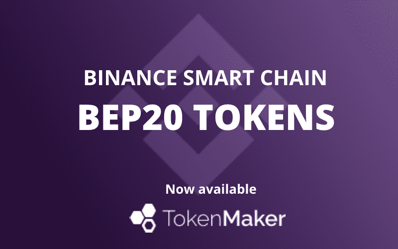

# TokenMaker

TokenMaker 是基于智能合约在以太坊网络上创建您自己的 ERC-20 或 ERC-223 代币的最简单、最快捷的方式。 无需编程技能 获得生成代币的 100% 所有权 自定义代币名称、符号和初始供应 自动验证和发布的合约源代码 代币转移期间的额外安全性 支持主网、Ropsten 测试网

这个星期一铸造你自己的代币！ 我们在币安智能链 (BSC) 上的新 BEP20 铸造服务现已推出！ 最多可以在 Binance Test 区块链上免费创建多达 1000 亿个 BEP20（币安智能链上的 ERC20 等效代币），或在 Binance Main 网络上收取少量费用。

