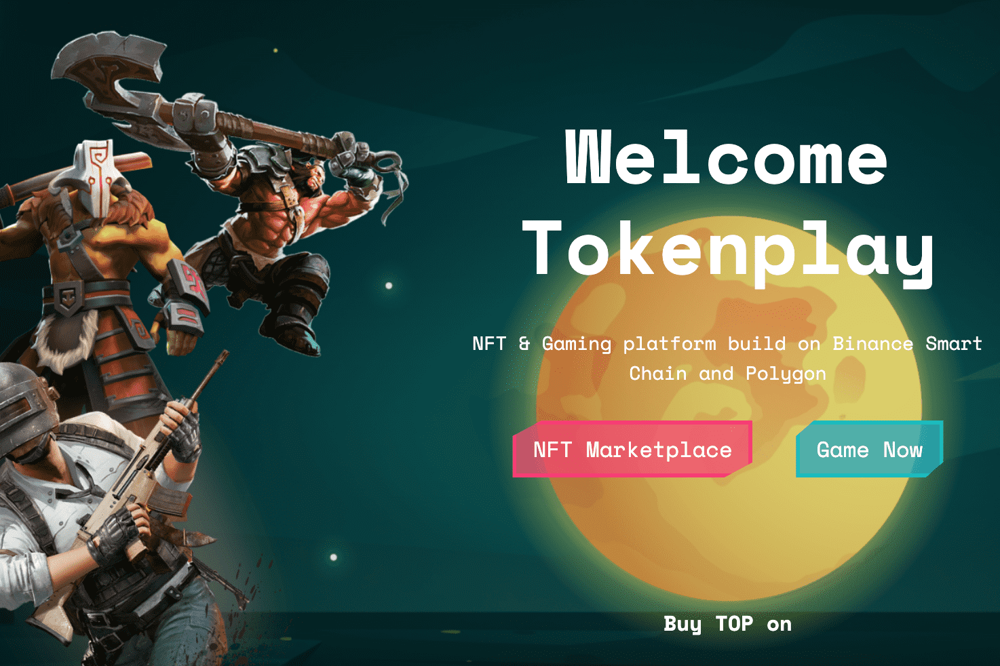

# Tokenplay

TokenPLay 是基于币安智能链和多链的 NFT 和游戏平台开发。 我们的愿景是成为区块链行业最大游戏的中心。 对我们来说，TokenPlay 不仅仅是一个游戏和 NFT 项目。 未来，我们将开发自己的手游，将休闲手游（非区块链游戏玩家）与区块链玩家连接起来。
令牌游戏的特殊功能
1️⃣ 市场
2️⃣ NFT 头像
3️⃣ 市场拍卖
4️⃣ 交易
5️⃣ 游戏币
6️⃣ TOP Token

活动
空投
奖学金

地平线上的“尝试 AR 滤镜”活动 | 150 美元空投

Horizon Land 活动：在 BNB Chain Revelation Hackathon 投票给 Horizon Land 为获奖者空投 1000 美元

