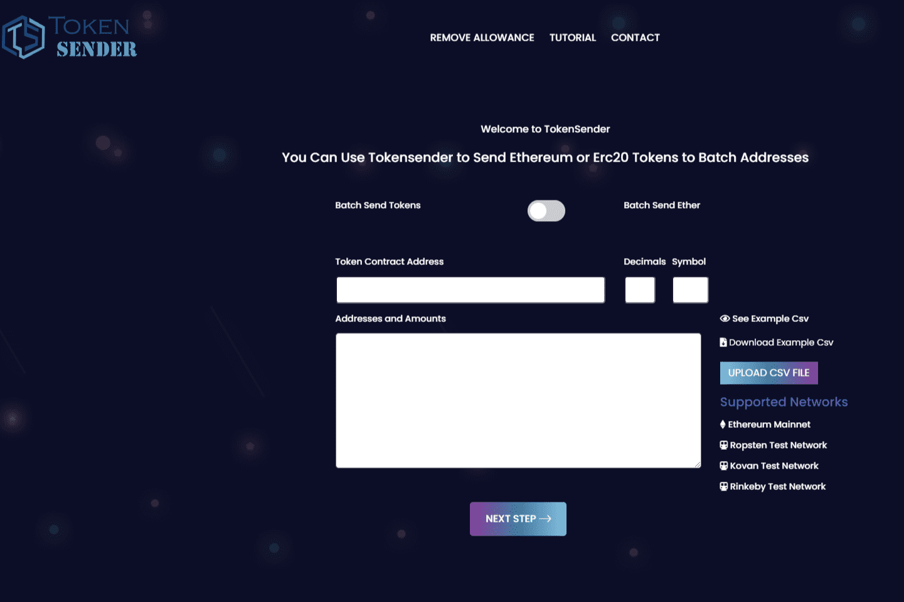

# Tokensender

什么是代币发送者？
Tokensender 提供了为用户进行批处理的机会。 只需支付一个

交易，用户可以同时发送到150个地址。 因此，用户可以一次支付

而不是支付 150 倍的费用，这有助于降低以太坊交易费用。

Tokensender是一个批量发送 Erc20 Tokens 和 Ethereum 的工具
您可以将 Ethereum 或 Erc20 发送到批处理地址。您可以将不同的金额发送到不同的地址。您可以从 csv 文件上传地址和金额，也可以复制粘贴它们。如果您的列表包含错误或重复的地址，请不要担心 Tokensender 会警告您并指出需要修复的地址或金额。

